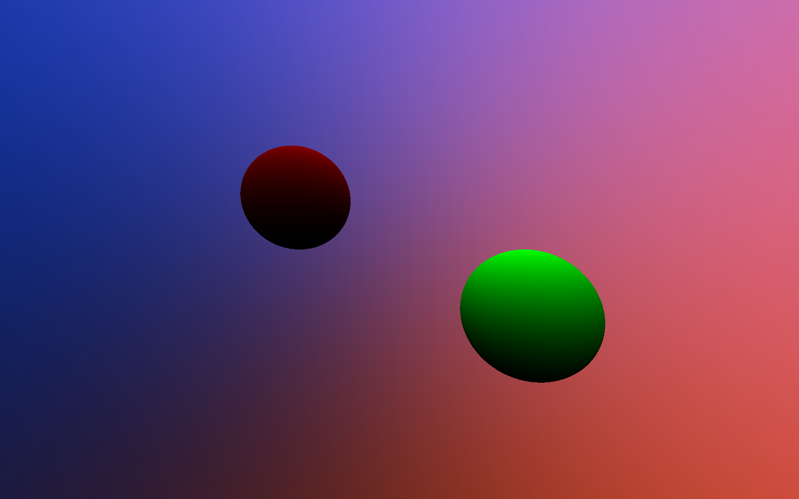

# Parallel Planets

## Table of Contents
- [About](#about)
- [Goals](#goals)
- [Progress Tracker](#progress-tracker)
- [Licence](#licence)

### About
The goal of this program is to implement a (simple) ray tracer and parallelise it using OpenMPI.

### Goals
- [ ] Parallel (OpenMPI) ray tracing program
- [ ] Objects moving according to a law of motion (ODE Solver)
- [ ] Object/camera movement and video generation
- [ ] Split work across a cluster (motion vs visualisation)

### Progress Tracker
| Name                          | Status        | Comment                                     |
|-------------------------------|---------------|---------------------------------------------|
| Static image ray traced       | in progress   | only simple shapes, like spheres and planes |
| OpenMPI integration           | to be started | basic division of work, one communicator    | 
| Reflective surfaces           | to be started | specular reflections                        |
| Transparent objects           | to be started | can include colour changes                  |
| Central force movement        | to be started | probably solved using Runge-Kutta
| dynamic image generation      | to be started | to simulate camera and/or object movement   |
| stitch images into a video    | to be started | probably using ffmpeg                       |
| OpenMPI cluster communication | to be started | surely networking is simple                 |

### Sample Output

### References

 - [Computer Graphics Principles and Practice By John F. Hughes, Andries Van Dam, Morgan McGuire, James D. Foley, David Sklar, Steven K. Feiner, Kurt Akeley · 2014](https://www.worldcat.org/title/computer-graphics-principles-and-practice/oclc/828142648)
 - [Ray Tracing in One Weekend](https://raytracing.github.io/books/RayTracingInOneWeekend.html)
 - [MPI Tutorial](https://mpitutorial.com)

### Licence
> This program (Parallel Planets) is free software: you can redistribute it and/or modify
    it under the terms of the GNU Affero General Public License as
    published by the Free Software Foundation, either version 3 of the
>
>    License, or (at your option) any later version.
    This program is distributed in the hope that it will be useful,
    but WITHOUT ANY WARRANTY; without even the implied warranty of
    MERCHANTABILITY or FITNESS FOR A PARTICULAR PURPOSE.  See the
>
>    GNU Affero General Public License for more details.
    You should have received a copy of the [GNU Affero General Public License](LICENCE)
    along with this program.  If not, see <https://www.gnu.org/licenses/>.