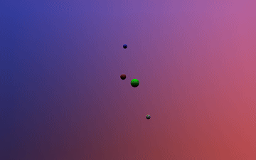

# Parallel Planets

## Table of Contents
- [About](#about)
- [Goals](#goals)
- [Progress Tracker](#progress-tracker)
- [Licence](#licence)

### About
The goal of this program is to implement a (simple) ray tracer and parallelise it using OpenMPI.

### Goals
- [x] Parallel (OpenMPI) ray tracing program
- [x] Objects moving according to a law of motion (ODE Solver)
- [x] Outputs as text and video
- [ ] Split work across a cluster (motion vs visualisation)
- [ ] Camera movement

### Progress Tracker
| Name                          | Status        | Comment                                     |
|-------------------------------|---------------|---------------------------------------------|
| Static image ray traced       | done          | only simple shapes, like spheres and planes |
| OpenMPI integration           | done          | basic division of work, one communicator    |
| Reflective surfaces           | to be started | specular reflections                        |
| Transparent objects           | to be started | can include colour changes                  |
| Central force movement        | done          | Using velocity Verlet method
| Dynamic image generation      | in progress   | to simulate camera and/or object movement   |
| Stitch images into a video    | done          | probably using ffmpeg                       |
| OpenMPI cluster communication | to be started | surely networking is simple                 |

### Sample Output

### How to Run

The build has been tested to work with cmake version 3.22 and gcc version 13.3. The mpi runtime tested to work is OpenMPI version 4.2. Please let me know if there's any incompatibilities with other versions.
There's a set of bash scripts scripts in the [scripts directory](scripts). Running [build.sh](scripts/build.sh) followed by your ninja path will build the executable. Alternatively, running [buildAndMpiRun.sh](scripts/buildAndMpiRun.sh)  will run the program with some default parameters as defined in the [mpiRun.sh](scripts/mpiRun.sh), which also has examples of available runtime options. Output will by default go to `outputs/` directory, but can be configured as well.
Stitching of the output images can be done via [imagesToVideo.sh](scripts/imagesToVideo.sh) or [imagesToGif.sh](scripts/imagesToGif.sh) into h265 video or a .gif respectively.

### Benchmarking

There's a set of test bash scripts scripts in the [test scripts directory](tests/scripts). By default, they'll produce a benchmarking .csv file in `tests/outputs/benchmarks`. Some examples of testing outputs can be found in the [tests output directory](tests/outputs/benchmarks/). Warning - some of the benchmarking scripts could take a long time to complete.

### References

 - [Computer Graphics Principles and Practice By John F. Hughes, Andries Van Dam, Morgan McGuire, James D. Foley, David Sklar, Steven K. Feiner, Kurt Akeley · 2014](https://www.worldcat.org/title/computer-graphics-principles-and-practice/oclc/828142648)
 - [Ray Tracing in One Weekend](https://raytracing.github.io/books/RayTracingInOneWeekend.html)
 - [Kendall, W. (n.d.). MPI tutorial. mpitutorial.com. Retrieved [2025-10-10]](https://mpitutorial.com)
 - [Pacheco, Peter S. An Introduction to Parallel Programming. Elsevier, 2011.](https://doi.org/10.1016/C2009-0-18471-4)
 - [E. Hairer, C. Lubich, and G. Wanner, Geometric Numerical Integration: Structure-Preserving Algorithms for Ordinary Differential Equations, 2nd ed. Springer, 2006.](https://link.springer.com/book/10.1007/3-540-30666-8)

### Licence
> This program (Parallel Planets) is free software: you can redistribute it and/or modify
    it under the terms of the GNU Affero General Public License as
    published by the Free Software Foundation, either version 3 of the
    License, or (at your option) any later version.
>
>   This program is distributed in the hope that it will be useful,
    but WITHOUT ANY WARRANTY; without even the implied warranty of
    MERCHANTABILITY or FITNESS FOR A PARTICULAR PURPOSE.  
>    
>   See the GNU Affero General Public License for more details.
    You should have received a copy of the [GNU Affero General Public License](LICENCE)
    along with this program.  If not, see <https://www.gnu.org/licenses/>.
